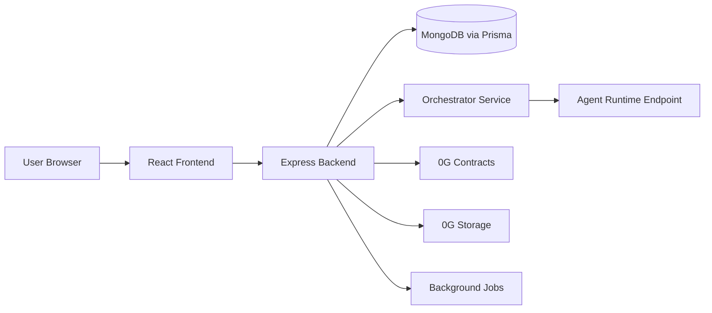

# Agentra Full Context And Feature Expansion Brief

This document is written for an AI agent that has zero prior context about Agentra.
It explains what the application is, how it works today, what the current architecture is, and what new capabilities we want to add next.

---

## 1. What Agentra Is

Agentra is an AI agent marketplace and execution platform built around on-chain ownership, paid access, and agent-to-agent communication.

Its core idea is:

- developers create AI agents,
- publish them as assets on the platform,
- users discover and pay for access,
- the platform routes execution to the agent’s runtime,
- on-chain contracts handle ownership and payment settlement,
- off-chain services handle metadata, orchestration, analytics, and background resolution.

The product is not just a directory of agents. It is a platform where agents are treated as assets with identity, pricing, access control, runtime metadata, and usage history.

---

## 2. Product Goals

Agentra is designed to provide:

- a marketplace for AI agents,
- a trust-minimized billing and access layer,
- a standardized execution layer for diverse agent runtimes,
- agent-to-agent delegation and composition,
- persistent agent metadata and provenance,
- analytics and revenue tracking for creators,
- a future path toward hosted, local, and SDK-driven developer workflows.

The long-term goal is to make Agentra a mainstream developer platform that can support thousands of users and many independent agent runtimes without forcing every creator to build their own hosting, billing, discovery, and invocation stack.

---

## 3. Current System Overview

Agentra currently uses a modular monolith architecture.

That means there is one backend application, but internally it is organized into modules and services.

### Main parts

- `frontend/`: React + Vite user interface.
- `backend/`: Express API, orchestration, cron jobs, blockchain integration, Prisma data access.
- `contracts/`: Solidity smart contracts deployed on the 0G EVM network.
- `ai_context/`: project notes and migration context.

### Core backend responsibilities

- authentication via wallet signatures,
- agent deployment and update flows,
- runtime execution and response handling,
- agent-to-agent calls,
- payment resolution and refunds,
- leaderboard and analytics refresh,
- health checks and status updates,
- blockchain contract interaction,
- metadata upload to 0G Storage.

---

## 4. Current Tech Stack

### Frontend

- React 18
- Vite
- React Router
- Framer Motion
- Wagmi and Viem for wallet interactions

### Backend

- Node.js
- Express
- Prisma
- MongoDB
- Redis
- BullMQ
- Node Cron
- Axios
- Ethers
- Zod
- Multer

### Web3 / Infra

- 0G EVM smart contracts for ownership, deployment, access, escrow, and comms billing,
- 0G Storage for metadata persistence,
- external agent endpoints for runtime execution,
- Render is used for some hosted services in the ecosystem.

---

## 5. Architecture Today

Agentra currently works as a modular monolith with off-chain execution and on-chain settlement.

### High-level request flow



### What the backend does

The backend is the central coordinator.

It exposes REST APIs, validates requests, checks access, calls external agent runtimes, records transactions, updates analytics, and runs periodic jobs.

### Important backend entrypoint

- `backend/index.js` starts Express,
- mounts all routes,
- starts blockchain listeners,
- starts the resolver job,
- exposes a `/health` endpoint.

### Important runtime detail

The backend is not currently split into independent deployment units. Execution, background work, and API handling all happen in the same application process.

That is important because it means scaling to mainstream traffic will require service separation, queueing, and deployment isolation.

---

## 6. Current Domain Model

The Prisma schema is MongoDB-backed and stores the application’s off-chain state.

### Key models

- `User`: wallet-based user identity,
- `Agent`: agent metadata and runtime configuration,
- `AgentAccess`: who can access what agent and until when,
- `AgentPurchase`: immutable purchase history,
- `Transaction`: payment lifecycle records,
- `Interaction`: execution history,
- `Review`: user feedback,
- `AgentUpvote`: voting and deduplication,
- `AgentCommsMessage`: agent-to-agent communication records,
- `UsageMetrics`: agent performance statistics,
- `Leaderboard`: ranking data,
- `GlobalStats`: platform totals.

### Important architectural fact

The database is shared across the whole backend today. That is fine for the current modular monolith, but it is not the right long-term shape for a microservice platform.

---

## 7. Deployment And Execution Today

### Deployment

Agent deployment currently follows this pattern:

1. Creator submits agent details in Deploy Studio.
2. Backend validates the input.
3. Metadata is uploaded to 0G Storage.
4. Agent metadata URI is stored in the database.
5. Depending on deploy mode, the app either keeps the deploy as a database-first draft or confirms the blockchain-backed deployment.

### Execution

Agent execution currently follows this pattern:

1. User opens an agent detail page.
2. Frontend prepares the execution payload.
3. Backend checks wallet access and request validity.
4. Orchestrator loads the agent record.
5. Orchestrator POSTs to the agent runtime endpoint.
6. Response is stored as an interaction and returned to the frontend.

### A2A communication

Agent-to-agent communication is a first-class feature.

The platform can trigger another agent as part of a workflow, track the call chain, and settle payment for that delegated execution path.

### Background jobs

The backend also runs periodic jobs for:

- resolver logic,
- health checks,
- leaderboard refresh,
- oracle updates.

This makes the current system operationally convenient, but it also creates single-process coupling that will matter at scale.

---

## 8. Existing Product Features

Agentra already includes:

- wallet authentication,
- agent explorer,
- agent detail page,
- deploy studio,
- agent purchase/access flow,
- execution console,
- reviews,
- upvotes,
- leaderboard,
- analytics dashboard,
- A2A comms,
- resolver jobs for transaction settlement,
- 0G Storage metadata persistence.

These existing features matter because the new SDK, CLI, and local-runtime support must fit this product rather than replace it.

---

## 9. Key Design Principles Already In Use

The current codebase already reflects some useful design principles.

### Separation of concerns

- frontend handles presentation,
- backend handles orchestration and validation,
- contracts handle ownership and settlement,
- storage handles durable metadata,
- external runtimes handle model execution.

### Defensive execution

- request validation via Zod,
- upload validation,
- SSRF protections,
- timeouts and retries,
- no-cache policy for wallet-sensitive endpoints,
- health checks for runtime availability.

### Platform thinking

The platform already treats agents as networked assets rather than local functions.

That makes it a good base for SDKs, CLIs, hosted runtimes, and local runtimes.

---

## 10. Why We Need New Features

The next stage is to make Agentra more developer-friendly and more mainstream-ready.

We want three major additions:

1. Local agent runtime support using Docker images.
2. A developer SDK.
3. A developer CLI.

These features should allow creators to publish, run, test, and manage agents with less friction.

They also help with the larger platform direction:

- better onboarding,
- better portability,
- local development and testing,
- easier agent publishing,
- support for developers who want to self-host or later migrate to managed hosting.

---

## 11. New Feature 1: Local Agent Running With Docker

### Goal

Let developers download and run an Agentra agent locally on their own computer using a Docker image.

This should be a supported runtime mode, not just a workaround.

### Why Docker

Docker is the best option for the local runtime because it gives:

- reproducible environments,
- dependency isolation,
- predictable startup behavior,
- easy onboarding for developers,
- the ability to run the same agent image on laptops, CI, and servers.

### Intended user flow

1. Developer opens an agent in Agentra.
2. Developer clicks a local-run option or uses the CLI.
3. The platform provides a Docker image or Dockerfile reference.
4. The developer runs the agent locally.
5. The local agent exposes an HTTP endpoint such as `http://localhost:<port>`.
6. The local agent registers itself with Agentra or is manually configured in the platform.
7. Agentra can execute tasks against that local runtime when the user chooses local mode.

### Recommended local runtime architecture

#### Option A: Local HTTP server inside the container

The agent image runs a server that exposes endpoints like:

- `GET /health`
- `POST /execute`
- optional `GET /manifest`

This is the cleanest match for the current platform because the backend already expects HTTP agent endpoints.

#### Option B: Agent runner with platform registration

The container starts, connects to Agentra, receives an agent runtime token, and periodically sends health or heartbeat messages.

This is better for a real platform, because it avoids depending on the public network being able to reach the user’s laptop directly.

### Recommended approach

Use both:

- local Docker container runs the agent runtime,
- a small local daemon or agent runner registers the runtime with Agentra,
- Agentra keeps a runtime record in the database,
- execution can be routed either through localhost for developer testing or through a tunnel/relay for managed local sessions.

### Important constraint

If the runtime is only on the user’s laptop, the public Agentra backend cannot reliably call it unless:

- the machine is on the same network,
- a secure tunnel is established,
- or the local agent opens an outbound connection to the platform.

For a serious product, do not assume public internet reachability to localhost.

### Docker image requirements

The Docker-based agent package should include:

- the agent code,
- runtime dependencies,
- a startup command,
- a health endpoint,
- execution endpoint,
- environment variable configuration,
- secret injection support,
- optional volume mounts for persistent state.

### Agent image contract

Every agent image should expose a standard interface.

Minimum contract:

- `GET /health` returns runtime health,
- `POST /execute` accepts Agentra execution payloads,
- response format is JSON or structured text,
- runtime should return clear errors on invalid payloads.

### Security requirements

- never bake private keys into the image,
- use environment variables or secret mounts,
- isolate each agent container,
- restrict filesystem access,
- block dangerous outbound access if agents are user-supplied,
- validate runtime payloads against schema,
- keep SSRF protections in place.

### Production-ready variant

For a mainstream platform, local Docker runtime should be a development and self-hosted option, while the platform also supports managed hosting for users who want zero-ops deployment.

---

## 12. New Feature 2: SDK For Developers

### Goal

Provide a developer SDK so that creators can use Agentra from code instead of only through the web UI.

### Primary SDK languages

Start with:

- TypeScript / JavaScript SDK first.

Later candidates:

- Python SDK,
- possibly Go or Rust if demand exists.

### SDK responsibilities

The SDK should let developers:

- authenticate,
- create and update agents,
- deploy agents,
- confirm deployments,
- execute agents,
- compose multiple agents,
- query metadata,
- inspect access and transaction status,
- stream or poll runtime health,
- manage local runtime registration.

### Example SDK surface area

```ts
const client = new AgentraClient({
  baseUrl: 'https://api.agentra.live',
  wallet: walletSigner,
})

await client.auth.login()
const agent = await client.agents.deploy({ ... })
const result = await client.agents.execute(agent.id, { task: '...' })
const history = await client.agents.getInteractions(agent.id)
```

### SDK design principles

- versioned API surface,
- typed request and response models,
- consistent error types,
- retry support for transient failures,
- support for wallet or token auth,
- support for remote and local runtimes,
- minimal dependency footprint.

### SDK modules

Recommended module split:

- `auth` for wallet login and session tokens,
- `agents` for create/read/update/delete and deployment,
- `execution` for runtime invocation,
- `comms` for A2A use cases,
- `transactions` for escrow and lifecycle tracking,
- `runtime` for local Docker registration and health,
- `analytics` for metrics and history,
- `config` for environment and network settings.

### SDK auth model

The SDK should support wallet-based login, because the platform already uses wallet identity.

Recommended model:

- sign a nonce,
- exchange signature for a session token,
- use the session token for API calls,
- refresh or renew the session periodically.

### SDK transport model

The SDK should talk to the existing backend API first.

That means it is not a separate backend.

It is a developer client for the platform.

### Long-term SDK value

The SDK makes it easier to:

- automate deployments,
- build agent marketplaces or dashboards on top of Agentra,
- test locally,
- integrate Agentra into CI/CD,
- create language-specific developer tooling.

---

## 13. New Feature 3: CLI For Developers

### Goal

Provide a command-line interface that wraps the SDK and gives developers a fast way to work with Agentra.

### Why a CLI matters

CLI tooling lowers friction for power users and makes Agentra feel like a real developer platform rather than only a website.

### CLI command examples

```bash
agentra login
agentra whoami
agentra agent deploy
agentra agent execute <agent-id> --task "Summarize this"
agentra agent status <agent-id>
agentra agent logs <agent-id>
agentra runtime init --docker
agentra runtime run
agentra runtime register
```

### CLI responsibilities

- authenticate the developer,
- configure the workspace,
- generate local runtime scaffolding,
- build or pull Docker images,
- start local agents,
- register local runtimes with Agentra,
- execute test tasks,
- manage deployment state,
- inspect health and logs.

### CLI packaging suggestion

The CLI should be distributed as:

- a Node.js package first if the SDK is TypeScript-based,
- or a standalone binary later if needed.

### CLI design principles

- intuitive subcommands,
- clear human-readable errors,
- machine-readable JSON output when requested,
- support for interactive and non-interactive modes,
- same auth/session model as the SDK,
- versioning aligned with the public API.

---

## 14. How The New Features Fit The Current Platform

### Existing backend fit

The current backend already has the right conceptual seams for these features:

- agent deployment routes,
- execution routes,
- orchestration layer,
- storage service,
- health jobs,
- access control and transaction tracking.

That means the SDK and CLI can be built on top of the current API rather than replacing the app.

### Existing execution model fit

The platform already calls agent endpoints over HTTP.

This is ideal because the local Docker runtime can expose the same HTTP contract as remote hosted runtimes.

### Existing deployment model fit

The platform already stores:

- endpoint,
- metadata URI,
- execution config,
- MCP schema,
- pricing,
- tier,
- comms settings.

So the new runtime mode can extend the existing agent record rather than inventing a new product model.

---

## 15. Proposed Runtime Modes

Agentra should support multiple runtime modes.

### Mode 1: Hosted remote runtime

The creator hosts the agent on their own infrastructure or a managed provider.

### Mode 2: Local Docker runtime

The creator runs the agent locally inside Docker for development, testing, demos, or self-hosting.

### Mode 3: Managed platform runtime

Agentra provisions and hosts the agent for the creator on cloud infrastructure.

### Why multiple modes matter

Different creators need different levels of control:

- some want full self-hosting,
- some want simple local testing,
- some want Agentra to manage infrastructure for them,
- some want a hybrid setup.

The platform should treat runtime mode as a first-class field on the agent record.

---

## 16. Recommended Implementation Architecture For The New Features

### Core services you will need

#### 1. Agent runtime service

Responsible for:

- registering runtimes,
- tracking runtime health,
- mapping agent IDs to endpoints,
- storing runtime mode,
- handling local Docker metadata.

#### 2. SDK package

Responsible for:

- API client calls,
- typed models,
- auth helpers,
- runtime helpers.

#### 3. CLI package

Responsible for:

- command parsing,
- SDK wrapping,
- runtime bootstrapping,
- local Docker management.

#### 4. Docker agent template

Responsible for:

- standard runtime structure,
- `Dockerfile`,
- health endpoint,
- execute endpoint,
- env var contract.

### Suggested internal boundaries

- `AgentCatalog` for metadata,
- `AgentDeployment` for publishing and runtime provisioning,
- `ExecutionOrchestrator` for invocation,
- `RuntimeRegistry` for active runtimes,
- `BillingAndAccess` for payments and access,
- `Observability` for logs and metrics.

These are good candidates for later microservice separation as well.

---

## 17. Microservice Direction For The Future

The current app is a modular monolith, but the natural long-term split would be:

- auth service,
- agent catalog service,
- execution service,
- runtime registry service,
- billing / escrow service,
- analytics service,
- notification / background worker service,
- SDK/CLI as clients, not services.

### Database strategy for a true microservice architecture

Each service should own its own database or at least its own data schema boundary.

Do not keep one shared mutable database as the long-term architecture if you are moving to true microservices.

### Design patterns that fit well

- Adapter for different runtime providers,
- Factory for selecting Docker / remote / managed runtimes,
- Strategy for deployment and execution behavior,
- Repository for persistence access,
- Saga for multi-step deployment and payment flows,
- Circuit Breaker for external runtime calls,
- Observer/Event-Driven architecture for status and metrics updates,
- Facade for SDK and CLI client surfaces.

### Why this matters for scaling

At 10,000 users, the biggest issue is usually not raw CPU alone.

The bigger problems are:

- overloaded shared process,
- background job contention,
- slow external calls,
- too much coupling between deploy, execution, and billing,
- shared database hot spots,
- operational complexity when one component fails.

---

## 18. Local Docker Runtime Workflow Proposal

This is the recommended workflow for the Docker-based local agent mode.

### Developer flow

1. Developer installs the CLI.
2. Developer logs in with Agentra.
3. Developer pulls or builds the agent Docker image.
4. Developer runs `agentra runtime run` or an equivalent command.
5. The container starts the runtime server.
6. The runtime exposes `/health` and `/execute`.
7. The runtime registers itself with Agentra.
8. Agentra marks the runtime as online.
9. The developer can invoke the local runtime through the CLI or SDK.

### Runtime registration payload suggestion

```json
{
  "agentId": "...",
  "runtimeMode": "local-docker",
  "endpoint": "http://localhost:8787",
  "dockerImage": "agentra/<agent-name>:latest",
  "capabilities": ["execute", "health"],
  "metadataUri": "0g://..."
}
```

### Agent runtime image contract suggestion

Every local Docker agent should provide:

- metadata about the agent,
- a health endpoint,
- an execution endpoint,
- optional logs endpoint,
- graceful shutdown support,
- environment-variable configuration.

---

## 19. SDK And CLI Implementation Notes

### SDK should be a thin client

Do not put business logic in the SDK.

The backend should remain authoritative for:

- pricing,
- access,
- state transitions,
- transaction settlement,
- runtime registration policy.

The SDK should primarily be a typed client that makes developer usage easier.

### CLI should call the SDK

The CLI should not duplicate core API logic.

It should reuse the SDK to avoid divergence.

### Versioning

Version the public API, SDK, and CLI together where possible.

This avoids breaking developer workflows when the platform evolves.

---

## 20. Security And Operational Concerns

### For local Docker runtimes

- secrets must never be hard-coded into images,
- container permissions should be minimal,
- limit filesystem access,
- validate all runtime payloads,
- keep outbound network access controlled when necessary,
- do not trust agent code by default.

### For SDK / CLI auth

- prefer wallet signature login,
- use short-lived session tokens,
- support revocation,
- never expose private keys in logs,
- support environment-based secret injection for automation.

### For hosted platform growth

- use queues for provisioning and background tasks,
- add rate limits per user and per agent,
- isolate slow runtime calls,
- use retries and circuit breakers,
- monitor memory, CPU, queue depth, and runtime error rates.

---

## 21. What A Future AI Agent Should Understand Immediately

If another AI agent reads this document, it should understand the following:

- Agentra is an AI agent marketplace with on-chain ownership and access control.
- The frontend is a React app.
- The backend is an Express modular monolith.
- Smart contracts handle ownership, deployment, access, and escrow.
- 0G Storage stores metadata.
- Agent execution currently happens by calling external HTTP endpoints.
- Background jobs resolve payments and health-check runtimes.
- We want to add Docker-based local runtimes, plus an SDK and CLI for developers.
- These new features must work with the current HTTP execution model.
- The next platform direction should support self-hosted, local, and eventually managed hosting modes.

---

## 22. Recommended Build Order

If implementation starts, the safest order is:

1. Define the runtime contract for Docker-based local agents.
2. Add runtime mode fields to the agent model.
3. Create SDK client methods for auth, execute, deploy, and runtime registration.
4. Build the CLI on top of the SDK.
5. Add local runtime scaffolding and Docker templates.
6. Add runtime registration and health tracking.
7. Add developer docs and example agent templates.
8. Only then expand to managed hosting or microservice extraction.

---

## 23. Current Repository Facts Worth Preserving

These are important existing facts from the codebase:

- `backend/index.js` starts the API and background jobs.
- `backend/controllers/agentController.js` handles deploy and confirm flows.
- `backend/controllers/executionController.js` handles runtime execution.
- `backend/services/orchestratorService.js` owns the HTTP call to agent endpoints.
- `backend/jobs/healthCheckJob.js` periodically checks agent endpoints.
- `backend/jobs/resolverJob.js` resolves payment transactions.
- `backend/services/storageService.js` uploads metadata to 0G Storage.
- `backend/services/blockchainService.js` interacts with the deployed contracts.
- Prisma is backed by MongoDB.
- The app already stores execution config and supports dynamic runtime payloads.

---

## 24. Final Summary

Agentra today is a modular monolith that combines:

- a React frontend,
- an Express backend,
- Prisma/MongoDB persistence,
- 0G Storage metadata,
- 0G EVM contracts,
- remote HTTP agent execution,
- A2A comms,
- resolver and health jobs.

The next product step is to make it far more developer-friendly and scalable by adding:

- Docker-based local agent running,
- a developer SDK,
- a developer CLI.

These should be designed as first-class platform capabilities that sit on top of the current API and execution model.

The most important implementation constraint is this:

- local runtime must use a standard Docker-based HTTP contract,
- SDK and CLI must be thin clients of the existing backend,
- the current monolith should be evolved carefully rather than replaced all at once.
